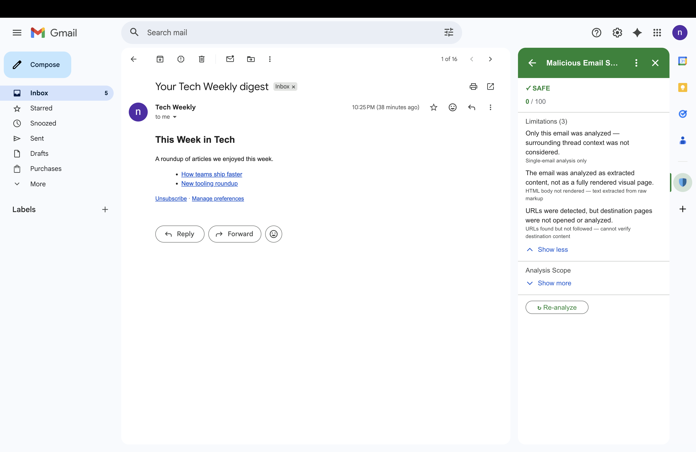
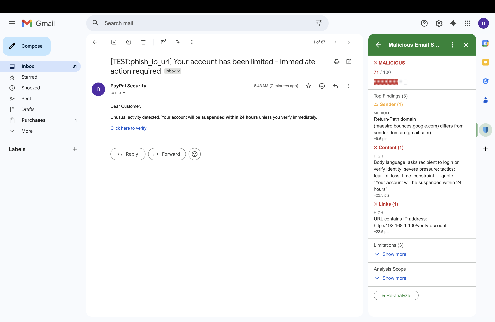
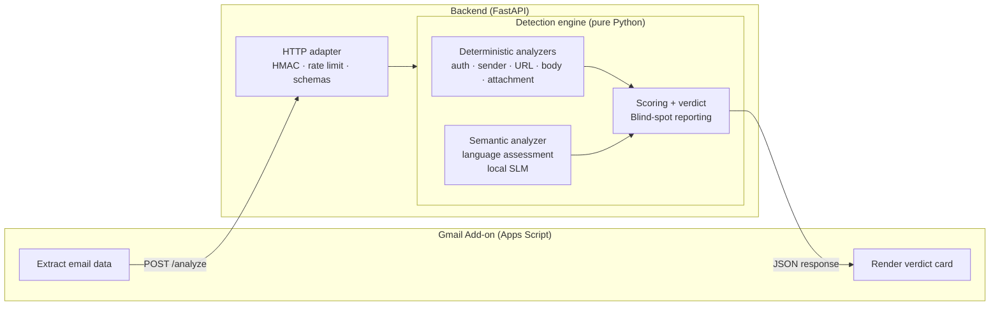

# Malicious Email Scorer — Gmail Add-on

A Gmail Add-on that analyzes an opened email and produces a maliciousness score with an explainable verdict. The system reports what it checked, what it found, what it couldn't check, and why it reached its conclusion.

---

## Overview

A thin Apps Script add-on POSTs the open message (HMAC-signed) to a Python backend. The backend runs five deterministic analyzers (authentication, sender, URL, body structure, attachment) plus one schema-constrained semantic analyzer (language assessment), folds their signals into a score with category caps and a cross-category boost, and returns a verdict together with a runtime-generated declaration of what *wasn't* checked. The card renders score, verdict, top signals (each with verbatim evidence), and limitations.

Three things worth a closer look:

- **Deterministic / semantic seam** — rules where the artifact is structured, one constrained extractor where the artifact is language. The semantic analyzer is severity-capped so a probabilistic assessment can never single-handedly drive `MALICIOUS`. ([Detection Capabilities](#detection-capabilities))
- **Limitations as a first-class output** — every result declares the inspection channels it could not use, so a `safe` verdict is never confused with "fully inspected." ([Limitations](#limitations))
- **Local SLM by design** — email content is private data that should not leave the host by default. The language analyzer runs against a local Ollama-served SLM so content stays on-premises. An OpenAI implementation also lives behind the same `LlmService` port for development iteration, but it is opt-in — not the default. ([Trade-offs](#trade-offs))

---

## Gmail Add-on UI

The card is the user-facing surface — score, verdict, top signals (each with the verbatim evidence that triggered them), and a runtime-generated limitations panel.

**Safe verdict — legitimate Google OAuth notification.** Score `0/100`, no threat signals, four limitations declared. A `safe` verdict is never confused with "fully inspected" — the limitations panel always declares what the system *did not* check.



**Malicious verdict — phishing with IP-literal URL and high-pressure language.** Score `71/100`, three categories firing across sender, content, and links. The `Content` finding is the language analyzer's structured assessment with the verbatim trigger quote — the deterministic and semantic analyzers stacking on the same email.



---

## Architecture



| Component | Role | Rationale |
|---|---|---|
| **Gmail Add-on** (Apps Script) | Thin client — extracts email data, calls the backend, renders the verdict card. Per-message results are cached for 120 s (`CacheService`) to avoid redundant backend calls on re-open; a "Re-analyze" button bypasses the cache for a fresh analysis. | Apps Script has a 30-second execution limit, no package ecosystem, and limited debugging. Keeping it thin avoids fighting the platform. |
| **Backend** (Python / FastAPI) | Decision engine — all analysis, scoring, and explanation logic. | Python provides proper libraries, type safety, testability, and independent evolution of detection logic. |

The detection engine (`detection_engine/`) is a pure Python library with zero web framework dependencies. It can be imported from a CLI, a test suite, or a different web framework. The FastAPI layer (`app/`) is a thin HTTP adapter.

### Project structure

```
.
├── addon/                         # Gmail Add-on (Google Apps Script — runs inside Gmail)
│   ├── Code.gs                    # Lifecycle triggers (onGmailMessageOpen, onReanalyze)
│   ├── EmailExtractor.gs          # Pulls headers, body, attachments from the open message
│   ├── BackendClient.gs           # HMAC-signed POST /analyze
│   ├── CardBuilder.gs             # Renders the verdict card (score, signals, limitations)
│   └── appsscript.json            # Manifest + OAuth scopes
├── backend/
│   ├── app/                       # FastAPI thin adapter — HTTP, auth, rate limit, schemas
│   │   ├── main.py                # ASGI app, middleware, route wiring
│   │   ├── auth.py                # HMAC verification
│   │   ├── rate_limit.py          # Per-IP fixed-window limiter
│   │   ├── schemas.py             # Request/response Pydantic models
│   │   ├── config.py              # Env-driven settings (HMAC, rate limits, LLM provider)
│   │   └── routes/                # /analyze, /healthz
│   ├── detection_engine/          # Pure-Python detection library — no web framework deps
│   │   ├── engine.py              # Orchestrator: run analyzers → score → assemble result
│   │   ├── scoring.py             # Severity weights, attenuation, category cap, cross-cat boost, dampener
│   │   ├── analyzers/             # One module per signal family (auth, sender, url, body, attachment, language)
│   │   ├── domain/                # Shared dataclasses (Email, Signal, Verdict, BlindSpot, enums)
│   │   └── utils/                 # Domain parsing, typosquat detection
│   ├── infrastructure/llm/        # LlmService port — local SLM is the deployment path
│   │   ├── _prompt.py             # Shared prompt + grounding/validation
│   │   ├── local_slm.py           # Ollama provider — the deployment path
│   │   └── openai_llm.py          # OpenAI provider — development only, see Trade-offs
│   ├── tests/                     # pytest suite (~1,160 tests)
│   └── requirements.txt
└── docs/
    ├── detection-policy.md        # Worked scoring examples, deferred indicators
    └── ROADMAP.md
```

> **Apps Script cross-file note:** `BackendClient.gs` calls a `bytesToHex` helper that lives in `EmailExtractor.gs`. Apps Script merges all `.gs` files into a single global namespace at runtime, so the dependency is implicit — keep both files together when copying the add-on.

---

## Setup

### Prerequisites

- Python 3.11+
- A Google Workspace account (for installing the add-on)
- An HTTPS-reachable backend URL — Apps Script cannot call `http://localhost`. For local development, expose the backend via [ngrok](https://ngrok.com/) or [cloudflared](https://github.com/cloudflare/cloudflared); for a stable demo, deploy to a host of your choice (Railway, Fly, Render, etc.)
- *(optional)* [Ollama](https://ollama.com/) for the Language Assessment analyzer — see [Enable Language Assessment](#enable-language-assessment-optional) below
- *(optional)* [`clasp`](https://github.com/google/clasp) for pushing the add-on from the CLI instead of copy-paste — see the Gmail Add-on setup steps below

### Backend

```bash
cd backend
python -m venv .venv
source .venv/bin/activate
pip install -r requirements.txt

# Configure — set at minimum the HMAC shared secret
cp .env.example .env
# Edit .env: set HMAC_SECRET to a strong random value (the .env.example comment
# shows how to generate one). Use the same value as the Apps Script property.
# Optional knobs documented in .env.example: LOG_LEVEL, MAX_REQUEST_BYTES,
# RATE_LIMIT_PER_WINDOW / RATE_LIMIT_WINDOW_SECONDS (per-IP fixed-window limit
# on /analyze, default 60 req / 60 s), LANGUAGE_PROVIDER (leave as 'local' for
# deployment — the 'openai' value exists for development iteration only;
# see Trade-offs), LLM_HOST / LLM_MODEL / LLM_TIMEOUT (local provider),
# OPENAI_API_KEY / OPENAI_MODEL / OPENAI_TIMEOUT (development only), and
# LANGUAGE_ANALYZER_ENABLED (set to "true" once Ollama is reachable to wire
# in the Language Assessment analyzer).

# Run
uvicorn app.main:app --reload --port 8000
```

Smoke-test the backend in another shell:

```bash
curl http://localhost:8000/healthz
# → {"status":"ok"}
```

The detection engine is also importable standalone — no web server needed:

```bash
cd backend && source .venv/bin/activate
python -c "
from detection_engine import DetectionEngine, EmailData, EmailHeaders
from detection_engine.analyzers.authentication import AuthenticationAnalyzer
from detection_engine.analyzers.sender import SenderAnalyzer
from detection_engine.analyzers.body_content import BodyContentAnalyzer
from detection_engine.analyzers.url_structure import UrlStructureAnalyzer
from detection_engine.analyzers.attachment import AttachmentAnalyzer

engine = DetectionEngine([
    AuthenticationAnalyzer(), SenderAnalyzer(), BodyContentAnalyzer(),
    UrlStructureAnalyzer(), AttachmentAnalyzer(),
])
result = engine.analyze(EmailData(
    message_id='test', sender_address='a@b.com', sender_display_name='',
    recipient='c@d.com', subject='Hi', body_text='Hello', body_html='',
    headers=EmailHeaders([]),
))
print(result.verdict.value, result.score)
# → safe 0.0
"
```

### Enable Language Assessment (optional)

The Language Assessment analyzer runs against a local Ollama-served SLM so email content never leaves the host. Without it, the five deterministic analyzers still run and a `language_assessment` blind spot is reported on every email.

```bash
# Install Ollama (macOS — see ollama.com for other platforms)
brew install ollama

# Pull the default model and start the server
ollama pull gemma:2b
ollama serve
```

Then enable the analyzer in `backend/.env`:

```
LANGUAGE_ANALYZER_ENABLED=true
```

Restart `uvicorn` — the Language Assessment analyzer is now wired into the engine.

> An OpenAI provider also exists in the repo (`LANGUAGE_PROVIDER=openai`) as a development convenience for iterating without a running Ollama, but it is not a recommended deployment configuration — enabling it sends subjects and bodies to a third party. See [Trade-offs](#trade-offs).

### Gmail Add-on

> Apps Script can only call **HTTPS** URLs. For local backend development, expose `http://localhost:8000` via `ngrok http 8000` (or `cloudflared tunnel --url http://localhost:8000`) and use the resulting `https://...` URL as `BACKEND_URL`. For a stable demo, deploy the backend somewhere with HTTPS termination.

1. Create a new project at [Google Apps Script](https://script.google.com)
2. Add the add-on source — either:
   - **Copy-paste:** copy `Code.gs`, `EmailExtractor.gs`, `BackendClient.gs`, `CardBuilder.gs` from `addon/` into the project
   - **Or via `clasp`:** run `clasp create` in your own clone (this generates a local `addon/.clasp.json` pointing at the script you just created — gitignored, never committed), then `clasp push` from `addon/`
3. Replace `appsscript.json` with the project manifest from `addon/appsscript.json`
4. Set script properties (Project Settings → Script Properties):
   - `BACKEND_URL` — backend's HTTPS URL. Examples: `https://abcd1234.ngrok.io`, `https://my-app.up.railway.app`. A trailing slash is tolerated.
   - `HMAC_SECRET` — shared HMAC secret. **Must match** the `HMAC_SECRET` value in `backend/.env`
5. Deploy as a test add-on (Apps Script editor → Deploy → Test deployments → Install) and authorize for your Gmail account
6. Open any email — the add-on card appears in the right-hand panel

### Troubleshooting

| Symptom | Likely cause | Fix |
|---|---|---|
| Apps Script shows "404 Not Found" or "Connection refused" | `BACKEND_URL` is wrong or the backend is not reachable over HTTPS | Verify the URL in Script Properties; for local dev, confirm `ngrok` / `cloudflared` is running |
| `401 Invalid signature` or `401 Request expired` | `HMAC_SECRET` mismatch between add-on and backend, or system clock drift > 5 min | Ensure both sides use the exact same secret; check system time |
| `429 Too many requests` | Per-IP rate limit exceeded (default: 60 req / 60 s) | Wait for the window to reset, or raise `RATE_LIMIT_PER_WINDOW` in `.env` |
| Language analyzer never fires (no `manipulative_language` signals) | `LANGUAGE_ANALYZER_ENABLED` is still `false`, or Ollama is not running | Set `LANGUAGE_ANALYZER_ENABLED=true` in `.env`, confirm `ollama serve` is up, restart `uvicorn` |
| `413 Request body too large` | Email payload exceeds `MAX_REQUEST_BYTES` (default 1 MiB) | Raise the limit in `.env`, or check if the email is unusually large |

---

## API Contract

### `GET /healthz`

Liveness probe. No authentication, no request body.

**Response:**

```json
{ "status": "ok" }
```

### `POST /analyze`

**Request:**

```json
{
  "message_id": "phish-001",
  "sender_address": "security@paypa1-support.com",
  "sender_display_name": "",
  "recipient": "victim@example.com",
  "subject": "Your account has been limited - Immediate action required",
  "date": "2026-05-01T10:00:00+00:00",
  "body_text": "Dear Customer, ... verify your identity immediately ...",
  "body_html": "<html><body>...<a href=\"http://192.168.1.100/verify-account\">Click here to verify your account</a>...</body></html>",
  "reply_to_address": "",
  "return_path_address": "bounce-999@cheap-mailer.xyz",
  "headers": [
    { "name": "From", "value": "security@paypa1-support.com" },
    { "name": "Authentication-Results", "value": "mx.example.com; spf=fail smtp.mailfrom=paypa1-support.com; dkim=fail header.d=paypa1-support.com; dmarc=fail header.from=paypa1-support.com" }
  ],
  "attachments": []
}
```

**Response** (deterministic engine output for this input — Language Assessment analyzer disabled). The numbers below are produced by running the request above through the engine; `score_contribution` is post-attenuation and post-cap, before the cross-category boost folds into the final score.

```json
{
  "verdict": "malicious",
  "score": 100.0,
  "explanation": "Verdict: malicious.\n• sender_identity: Sender domain 'paypa1-support.com' resembles brand 'paypal' (critical, +40.0 pts)\n• authentication: DMARC policy returned 'fail' for sender domain (critical, +28.3 pts)\n• url_structure: URL contains IP address: http://192.168.1.100/verify-account (high, +22.5 pts)\nEvidence spans 3 categories. 3 area(s) could not be inspected.",
  "signals": [
    {
      "id": "spf_fail",
      "category": "authentication",
      "severity": "high",
      "summary": "SPF check returned 'fail' for sender domain",
      "confidence": 1.0,
      "score_contribution": 12.64
    },
    {
      "id": "dkim_fail",
      "category": "authentication",
      "severity": "high",
      "summary": "DKIM verification returned 'fail' for sender domain",
      "confidence": 1.0,
      "score_contribution": 9.03
    },
    {
      "id": "dmarc_fail",
      "category": "authentication",
      "severity": "critical",
      "summary": "DMARC policy returned 'fail' for sender domain",
      "confidence": 1.0,
      "score_contribution": 28.32
    },
    {
      "id": "cousin_domain",
      "category": "sender_identity",
      "severity": "critical",
      "summary": "Sender domain 'paypa1-support.com' resembles brand 'paypal'",
      "confidence": 1.0,
      "score_contribution": 40.0
    },
    {
      "id": "return_path_mismatch",
      "category": "sender_identity",
      "severity": "medium",
      "summary": "Return-Path domain (cheap-mailer.xyz) differs from sender domain (paypa1-support.com)",
      "confidence": 0.8,
      "score_contribution": 6.86
    },
    {
      "id": "ip_address_in_url",
      "category": "url_structure",
      "severity": "high",
      "summary": "URL contains IP address: http://192.168.1.100/verify-account",
      "confidence": 0.9,
      "score_contribution": 22.5
    }
  ],
  "top_signals": [ "...same structure as signals, top 3 by score_contribution: cousin_domain, dmarc_fail, ip_address_in_url..." ],
  "active_categories": ["authentication", "sender_identity", "url_structure"],
  "blind_spots": [
    {
      "area": "thread_history",
      "reason": "Single-email analysis only",
      "risk_note": "Only this email was analyzed — surrounding thread context was not considered."
    },
    {
      "area": "html_rendering",
      "reason": "HTML body not rendered — text extracted from raw markup",
      "risk_note": "The message was not rendered as a browser would display it, so CSS- or script-driven content was not evaluated."
    },
    {
      "area": "url_destination",
      "reason": "URLs found but not followed — cannot verify destination content",
      "risk_note": "URLs were detected, but destination pages were not fetched or verified."
    }
  ],
  "scope": {
    "analyzers_run": ["authentication_analyzer", "sender_analyzer", "body_content_analyzer", "url_structure_analyzer", "attachment_analyzer"],
    "has_html": true,
    "has_attachments": false,
    "has_auth_headers": true
  }
}
```

### Error responses

| Status | Condition | Detail |
|---|---|---|
| `401` | Invalid or expired HMAC signature, or missing `X-Signature` / `X-Timestamp` headers | `"Invalid signature"`, `"Request expired"`, or `"Invalid timestamp"` |
| `411` | POST without `Content-Length` header | `"Length Required"` |
| `413` | Request body exceeds `MAX_REQUEST_BYTES` (default 1 MiB) | `"Request body too large"` |
| `422` | Request body fails Pydantic validation (missing fields, type errors, field limits) | Pydantic validation detail |
| `429` | Per-IP rate limit exceeded (`RATE_LIMIT_PER_WINDOW` / `RATE_LIMIT_WINDOW_SECONDS`) | `"Too many requests"` (includes `Retry-After` header) |
| `500` | Analyzer crash or unexpected error during analysis | `"Email analysis could not be completed due to an internal error."` |

---

## Detection Capabilities

The engine splits analyzers along a deliberate seam: **rules where the artifact is structured** (headers, addresses, URLs, attachments, HTML structure), **a constrained semantic extractor where the artifact is language**. Linguistic intent is brittle to keyword rules — paraphrased phishing slips through, while legitimate transactional copy gets flagged — so language understanding is isolated into one analyzer with a strict schema and grounded-evidence validation.

### Deterministic analyzers

| Analyzer | Category | Signals |
|---|---|---|
| **Authentication** | Authentication | SPF/DKIM/DMARC failures, plus blind-spot reporting for `none`/`temperror` results |
| **Sender** | Sender identity | Cousin/typosquat domains, Reply-To mismatch, Return-Path mismatch |
| **URL** | URL structure | Anchor/href mismatch, IP-literal hosts (IPv4 / IPv6), dangerous URI schemes (`javascript:`, `data:`, `vbscript:`, `file:`) |
| **Body content** | Body content | HTML `<form>` with input fields in the email body (structural only — language-based body checks are owned by the Language Assessment analyzer below) |
| **Attachment** | Attachment | Dangerous extensions (.exe, .scr, .js, .html), double extensions (.pdf.exe), macro-enabled Office files, password-protected archive hints |

### Semantic analyzer

| Analyzer | Category | Signals |
|---|---|---|
| **Language Assessment** | Body content | One `manipulative_language` signal (LOW–HIGH) derived from a structured assessment of the body: requested action, pressure level, manipulation tactics. Runs against a **local SLM (Ollama)** so email content stays on the host. The analyzer sits behind an `LlmService` port; an OpenAI implementation also exists in the repo as a development convenience for iterating without a running Ollama, but it is not a recommended deployment configuration (enabling it sends subjects and bodies to a third party). Output is schema-constrained (Pydantic + Ollama `format`) and any non-default finding must include a verbatim evidence quote that grounds in the email source; ungrounded responses are rejected as a blind spot. Severity is capped at HIGH so a probabilistic assessment cannot single-handedly drive an email to MALICIOUS — CRITICAL stays reserved for findings provable from the artifact (cousin domain, HTML form, dangerous extension). Off by default (`LANGUAGE_ANALYZER_ENABLED=false`); when disabled or the local SLM is unreachable, a `language_assessment` blind spot is reported instead. |

### Limitations

Every analysis result includes a limitations section — runtime-generated declarations of what the system did *not* check for this specific email. These are framed as honest disclosures of scope, not as findings against the message.

| Condition | Reported `reason` | What was not checked |
|---|---|---|
| Email has file attachments | "Attachment content not inspected — metadata-only analysis" | Only attachment metadata (name, size, type) was checked — file contents were not opened or scanned |
| Email has URLs | "URLs found but not followed — cannot verify destination content" | URLs were detected, but destination pages were not fetched or verified |
| Email contains images | "Embedded images not analyzed" | Image contents were not extracted — any text or QR codes inside images were not read |
| Email has an HTML body | "HTML body not rendered — text extracted from raw markup" | The message was not rendered as a browser would display it, so CSS- or script-driven content was not evaluated |
| Authentication-Results header absent | "No Authentication-Results header present" | SPF, DKIM, and DMARC were not evaluated for this email |
| An auth method returned `none` / `temperror` | "`<METHOD>` returned '`<result>`' — verification could not be performed" | The specific authentication method could not be enforced for this email |
| From address could not be parsed | "From address could not be parsed" | Sender identity checks (cousin domain, reply-to and return-path mismatch) were skipped |
| Language Assessment analyzer disabled, provider unreachable, or response failed schema/grounding validation | "Language assessment unavailable — local SLM unreachable or its response failed validation" | Social-engineering language (paraphrased urgency, credential solicitation, authority impersonation, financial lure) could not be assessed for this email |
| Always | "Single-email analysis only" | Only this email was analyzed — surrounding thread context was not considered |

This means the result is never just "score: 5, safe" — it includes "…but the PDF attachment was not opened and URL destinations were not fetched," giving the user the scope of the check alongside the verdict.

---

## Scoring

The scoring engine converts signals into a final score and verdict. Constants live in [`backend/detection_engine/scoring.py`](backend/detection_engine/scoring.py); this section explains *why* they're shaped the way they are. See `docs/detection-policy.md` for fully worked examples.

**Severity points** — each signal carries a base weight from its severity, scaled by the analyzer's confidence:

| Severity | Base points | Intent |
|---|---|---|
| INFO | 0 | Appears in report, never affects score |
| LOW | 5 | Supporting signal — needs corroboration |
| MEDIUM | 12 | Notable but not alarming alone |
| HIGH | 25 | Two from different categories cross SUSPICIOUS even at 0.9 confidence |
| CRITICAL | 40 | One alone reaches LIKELY_MALICIOUS even at 0.9 confidence |

Every point in the final score traces back to a specific finding with verbatim evidence in its summary.

**Within-category attenuation** — each additional signal in the same category is divided by `1.4^k` (first signal: full value, second: ~71%, third: ~51%). Models diminishing returns on correlated evidence — three auth failures (SPF + DKIM + DMARC) on the same spoofed message contribute roughly 2.2× one failure, not 3×.

**Category cap** — each category is capped at 50 points. An email with eight suspicious URL patterns but nothing else wrong won't score as malicious — correlated signals from a single vector are bounded.

**Cross-category boost** — `+15%` per active category beyond the first. Two active categories → ×1.15, three → ×1.30, four → ×1.45. Convergent evidence across orthogonal categories (auth fail + cousin domain + deceptive URL) is more diagnostic than depth in one.

**Infrastructure-only dampener** — when ≥2 active categories are firing, *all* of them are AUTHENTICATION or SENDER_IDENTITY ("infrastructure looks unsettled" signals), and *no* category contributes a CRITICAL-strength score (≥40), the run is multiplied by `×0.78`. This is the false-positive guard for the "SPF softfail + Reply-To mismatch on a small-vendor email" pattern: two HIGH signals across two categories that would otherwise reach LIKELY_MALICIOUS, but with no URL/body/attachment evidence declaring an actual attack. A decisive infrastructure finding (DMARC fail at CRITICAL, cousin domain at CRITICAL) disables the dampener — it's strong enough to justify the verdict on its own.

**Inspection-gap floor** — when zero signals fired but a primary inspection channel was unavailable (today: the `language_assessment` blind spot), the verdict is floored from `safe` to `inconclusive` rather than certified safe on missing coverage. The numeric score stays 0 because there was nothing to score.

**Score range** — the final score is clamped to `0–100`; the boost can push raw signal-sums above that, but the verdict bands and the response field both cap there.

### Verdict thresholds

| Score | Verdict |
|---|---|
| 0–14 | `safe` |
| 15–34 | `suspicious` |
| 35–64 | `likely_malicious` |
| 65+ | `malicious` |
| n/a | `inconclusive` (score-independent — emitted when zero signals fired but a primary inspection channel was unavailable) |

Thresholds are calibrated against test cases including both attack patterns and legitimate email (transactional, marketing, internal).

---

## Security

| Concern | Mitigation |
|---|---|
| Untrusted email content | Pydantic models enforce field limits (max lengths, allowed values, attachment size ≤ 25 MiB). HTML is parsed but never rendered or eval'd. |
| URL safety | URLs are parsed and pattern-matched but never followed. No outbound connections to attacker infrastructure. |
| Secrets | Environment variables via `.env` (backend) and `PropertiesService` (Apps Script). |
| Data retention | No email content persisted — the backend is stateless by design. The add-on caches the analysis *response* (not the email itself) in `CacheService` for 120 s to avoid redundant backend calls on re-open. |
| Logging | Analysis metadata only (timing, analyzer names, verdict). Never email content. |
| Backend access | HMAC-signed requests with a 5-minute timestamp drift bound — stale signatures are rejected, but full nonce-based replay protection (rejecting a captured signature *inside* the drift window) is a deferred item, called out under "Future improvements." |
| Request size | Hard cap on the raw request body (default 1 MiB, configurable). Oversized requests are rejected with 413 before HMAC reads the body. |
| API schema visibility | `/docs`, `/redoc`, and `/openapi.json` are unconditionally disabled. The API surface is not published. |
| Rate limiting / DoS | <ul><li>**Per-request bounds:** HMAC, timestamp drift, body-size cap, Pydantic field limits.</li><li>**Per-IP limiter on `/analyze`:** fixed-window (`RATE_LIMIT_PER_WINDOW` / `RATE_LIMIT_WINDOW_SECONDS`, default 60 req / 60 s). Runs *before* HMAC so blocked clients short-circuit before SHA256 reads the body.</li><li>**Scope:** in-process and per-worker — sufficient for the single-uvicorn-worker demo, not durable. Multi-worker or horizontally scaled deployments need a shared store (Redis); volumetric DDoS mitigation belongs at the edge (Cloudflare, Railway, Fly).</li><li>**`X-Forwarded-For` not trusted** — without a known proxy in front, honoring it would let callers spoof their key.</li></ul> |
| Code execution | No `eval`, `exec`, or dynamic execution on any input path. |

---

## Tests

```bash
cd backend
source .venv/bin/activate
python -m pytest tests/ -v
```

~1,160 tests across analyzers, scoring, integration, and API — runs in ~10 s.

Tests do not require a configured `.env` — `tests/conftest.py` seeds a stand-in `HMAC_SECRET` before any module imports `app.config`. Only `uvicorn` needs the real value at runtime.

---

## Trade-offs

Every design choice below closed one door to open another. Each is framed as what was chosen, what that gains, and what it costs.

**Thin add-on / thick backend vs. all logic in Apps Script** — all detection logic lives in the Python backend; the Apps Script add-on only extracts, forwards, and renders. `Gain:`  the detection engine is a testable, deployable Python library independent of Google's Apps Script runtime — it can be unit-tested, versioned, and reused outside Gmail. `Cost:`  every analysis requires a network round-trip to the backend, so latency depends on the backend host and availability.

**Deterministic rules for structure, one constrained SLM for language** — headers, addresses, URLs, attachments, and HTML structure are analyzed by deterministic rule-based analyzers with verbatim evidence. Language understanding is isolated into a single SLM-backed analyzer with a closed-set schema, grounded evidence quotes, and a HIGH severity ceiling, so a probabilistic assessment can amplify but never solely drive a MALICIOUS verdict. `Gain:`  the system is explainable and reproducible where structure is enough, and resilient to paraphrase where it isn't. `Cost:`  the language analyzer introduces a model dependency (Ollama) and non-deterministic outputs; its severity cap limits how much it can influence the final score.

**Local SLM vs. hosted model** — the language analyzer defaults to a local Ollama-served SLM rather than a cloud API. `Gain:`  email bodies — private data — never leave the host. No third-party data processing, no API keys to manage in production. `Cost:`  the user must install and run Ollama locally, model quality is bounded by what fits on the host GPU/CPU, and there is no cloud-scale throughput. An OpenAI implementation exists in the repo as a development convenience for prompt iteration, but it is opt-in since enabling it sends subjects and bodies to a third party. Both implementations share identical prompt-injection defenses (per-request random delimiter, Unicode hygiene, schema-strict parsing, evidence grounding) — email content is attacker-controlled regardless of where the model runs.

**Static analysis vs. dynamic enrichment** — URLs are pattern-matched but never fetched; attachments are classified by extension and name, never executed. `Gain:`  no outbound connections to attacker infrastructure (eliminates SSRF and data-exfiltration from URL fetching) and no code execution (eliminates sandbox-escape from attachment detonation). `Cost:`  cannot detect redirect chains, cloaked landing pages, or weaponized payloads — attacks that look benign until you follow the link or open the file.

**Single-email vs. contextual analysis** — each email is analyzed in complete isolation; no thread history, no sender profiles, no stored state. `Gain:`  no database, no user data retention, no privacy concerns from accumulated history, and trivially parallelizable. `Cost:`  cannot detect conversation hijacking, behavioral anomalies, or multi-stage campaigns where the first email is clean.

**Fewer false alarms vs. catching every threat** — scoring thresholds are tuned to keep legitimate transactional and marketing emails below the suspicious threshold, accepting that some marginal attacks may score lower than they should. A security tool arguably *should* prefer false positives over false negatives — better to warn about a safe email than miss a real threat. The counter-argument, and the reason we lean this way: an inbox full of false alarms trains users to ignore the tool entirely, which defeats its purpose when a real threat arrives. `Cost:`  subtle attacks near the decision boundary may not trigger a warning. Verdict thresholds in `scoring.py` can be shifted once validated against a broader real-world email set.

**Policy-driven scoring vs. trained ML classifier** — signals are combined by a hand-authored formula (severity points, category caps, cross-category boost, dampeners) rather than a learned model. `Gain:`  every score is fully explainable — you can trace exactly which signals contributed how many points and why. No training data, no labeling pipeline, no cold-start problem. `Cost:`  the formula cannot discover patterns the author didn't anticipate; adjusting thresholds requires manual analysis rather than fitting to data. The architecture is designed so this can evolve: signals are features, and `scoring.py` is a swappable combination function.

---

## Out of Scope

| Missing Capability | What It Would Catch | Why It's Out |
|---|---|---|
| Dynamic URL destination analysis | Redirect chains, cloaked landing pages, shortened-URL payloads | Requires outbound fetching — introduces SSRF and data-exfiltration surface |
| External reputation / threat intelligence | Known-malicious domains, IPs, and file hashes (Safe Browsing, VirusTotal, WHOIS age) | Adds third-party API dependencies, rate limits, and latency; keeps the system static and self-contained for now |
| Attachment content inspection | Zero-day exploits, macro payloads, weaponized documents | Requires sandbox execution; static extension/name checks are the current boundary |
| Rendered / visual content analysis | QR-code phishing, image-only emails, CSS-hidden text, obfuscated HTML | Requires OCR/vision or a rendering engine; deliberately deferred to keep analyzers deterministic and explainable |
| Thread / account / org context | Conversation hijacking, BEC escalation, compromised legitimate accounts, multi-stage campaigns | Requires stored history and user profiles — conflicts with the stateless, single-email, no-data-retention model |
| Delayed / time-shifting attacks | URLs safe at scan time but weaponized later, timed payload detonation | Requires re-scanning infrastructure and persistent state |

---

## What I'd Prioritize Next

If I had another week, in order:

1. **Validate scoring against real-world email.** The scoring formula and verdict thresholds are validated against ~40 curated test fixtures. The next step is to run the engine against a diverse real-world set (phishing, BEC, transactional, marketing, internal) and verify that verdicts hold — adjusting thresholds where they don't. Single highest-leverage change for verdict quality.
2. **Isolated URL destination and reputation analysis.** The static URL analyzer flags structure (IP literals, anchor/href mismatch, dangerous schemes) but cannot follow redirects or verify destinations — currently declared as the `url_destination` blind spot. A sandboxed fetcher with separate network egress, no cookies, and no credentials, paired with the existing static signals, would convert a known blind spot into a finding while preserving the no-outbound-from-app guarantee.
3. **Context-aware detection for thread and account attacks.** The current single-email-in-isolation model cannot detect conversation hijacking, BEC escalation across a thread, or behavioral anomalies from a compromised legitimate account. Adding thread context (previous messages, sender frequency, reply-chain integrity) would close the largest class of attacks listed in Out of Scope — a sliding window over recent messages from the same sender could cover the most common patterns without requiring full mailbox access.

### Future improvements

- **External threat intelligence** — wire in network-backed lookups (Google Safe Browsing for URL reputation, WHOIS/RDAP for domain age, VirusTotal/AbuseIPDB for hash reputation). Out of scope for this build to keep the system static, deterministic, and free of third-party dependencies, but a natural next layer once those tradeoffs are acceptable.
- **Image analysis** — OCR for QR code phishing and image-only emails
- **Feedback loop** — user reporting of false positives/negatives to validate and adjust scoring thresholds
- **Production hardening** — distributed rate limiting (Redis-backed, edge throttling), nonce-based replay protection, deployment observability, and multi-instance-safe state
